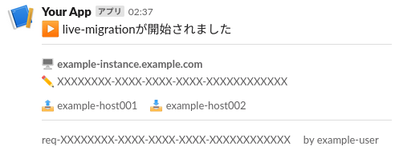

# live-migration-notifier

OpenStackのLiveMigrationの通知するくん



## 使い方

```sh
# config.yml の情報を埋めます
$ cp config.yml.sample config.yml
$ vim config.yml

$ ./live-migration-notifier
```

systemdで動かす場合にはUnitファイルを作る必要があります。
その場合は[サンプル](systemd/live-migration-notifier.service)を参考にしてください。
